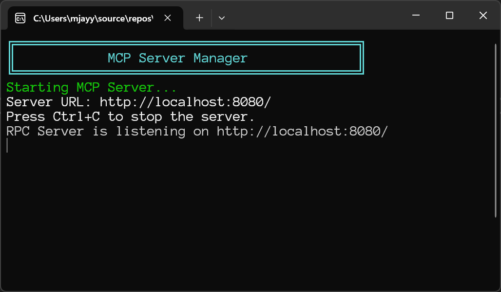

# MCP Server-Client Solution

A .NET 8.0 solution that implements a Model Context Protocol (MCP) server with an intelligent client that orchestrates LLM interactions and database operations through configuration-driven architecture.

## Overview

This solution provides a complete MCP ecosystem consisting of:
- **MCPServer**: HTTP-based JSON-RPC server with SQL Server integration
- **MCPClient**: LLM-powered client with intelligent tool orchestration
- **Configuration Management**: Centralized settings with environment-specific overrides

## Architecture

### MCPServer
- **HTTP Server** running on configurable host/port (default: `http://localhost:8080/`)
- **Database Service** with SQL Server integration and secure connection handling
- **JSON-RPC** communication protocol with CORS support
- **Tool Discovery** via `tools.json` configuration
- **Configurable** server settings through `appsettings.json`



### MCPClient
- **LLM Orchestrator** for intelligent tool selection and execution
- **Dynamic Tool Executor** for runtime tool invocation
- **Health Checker** for server connectivity validation
- **Interactive Console** for natural language database queries
- **Multi-LLM Support** with configurable providers (OpenAI, DeepSeek, Gemini)


## Key Features

- **Intelligent Tool Orchestration**: LLM-powered decision making for tool selection
- **Dynamic Tool Execution**: Runtime discovery and execution of database tools
- **Multi-Provider LLM Support**: Configurable LLM providers with API key management
- **Database Integration**: Direct SQL Server connectivity with secure connection handling
- **Interactive Interface**: Console-based query interface with colored output
- **Configuration-Driven**: Easy setup through template-based configuration files
- **Security-First**: Request validation, SQL injection protection, and secure credential management

## Prerequisites

- .NET 8.0 SDK or later
- SQL Server instance (local or remote)
- LLM API credentials for your preferred providers
- Network access to the target database

## Quick Start

### 1. Clone and Setup
```bash
git clone <repository-url>
cd MCP-Agent
```

### 2. Server Configuration
```bash
cd MCPServer
cp appsettings.template.json appsettings.json
# Edit appsettings.json with your database connection string
```

### 3. Client Configuration
```bash
cd MCPClient
cp appsettings.template.json appsettings.json
# Edit appsettings.json with your LLM API keys
```

### 4. Start the Server
```bash
cd MCPServer
dotnet run
```

### 5. Run the Client
```bash
cd MCPClient
dotnet run
```

## Configuration

### Server Configuration (`MCPServer/appsettings.json`)
```json
{
  "ConnectionStrings": {
    "DefaultConnection": "Server=YOUR_SERVER\\INSTANCE;Database=YOUR_DATABASE;User ID=YOUR_USERNAME;Password=YOUR_PASSWORD;TrustServerCertificate=True;MultipleActiveResultSets=true"
  },
  "ServerSettings": {
    "BaseUrl": "http://localhost:8080/"
  }
}
```

### Client Configuration (`MCPClient/appsettings.json`)
```json
{
  "Server": {
    "Host": "localhost",
    "Port": 8080,
    "RequestTimeoutSeconds": 30,
    "MaxRequestSizeMB": 1
  },
  "LLM": {
    "DefaultProvider": "DeepSeek",
    "DefaultTemparature": "0.2",
    "DefaultMaxTokens": "4096",
    "OpenAI": {
      "ApiKey": "your-openai-api-key",
      "Model": "gpt-3.5-turbo"
    },
    "DeepSeek": {
      "ApiKey": "your-deepseek-api-key",
      "Model": "deepseek-chat"
    },
    "Gemini": {
      "ApiKey": "your-gemini-api-key",
      "Model": "gemini-1.5-flash"
    }
  }
}
```

## Available Tools

The server provides several built-in tools for database operations:

| Tool | Description | Parameters |
|------|-------------|------------|
| `health` | Server health check | None |
| `executeSQL` | Execute SQL queries | `query` (string) |
| `getTableSchema` | Get table structure | `tableName` (string) |
| `getDatabaseSchema` | Get full database schema | None |
| `getTools` | List available tools | None |

## Usage Examples

### Interactive Client Session
```
🤖 LLM Orchestrator ready! Type 'exit' to quit.
❓ Question: What tables exist in the database?
❓ Question: Show me the structure of the Users table
❓ Question: exit
👋 Goodbye!
```

### Direct API Calls
```bash
# Health check
curl -X POST http://localhost:8080/ \
  -H "Content-Type: application/json" \
  -d '{"jsonrpc": "2.0", "id": "health-1", "method": "health", "params": {}}'

# Execute SQL
curl -X POST http://localhost:8080/ \
  -H "Content-Type: application/json" \
  -d '{"jsonrpc": "2.0", "id": "sql-1", "method": "executeSQL", "params": {"query": "SELECT TOP 5 * FROM Users"}}'
```

## Project Structure

```
MCP-Agent/
├── MCPServer/                    # HTTP server with database integration
│   ├── Program.cs                # Application entry point
│   ├── Server.cs                 # HTTP server implementation
│   ├── DatabaseService.cs        # Database operations
│   ├── SqlConnectionFactory.cs   # Connection management
│   ├── tools.json                # Tool definitions
│   ├── appsettings.template.json # Configuration template
│   └── ServerConfiguration.cs    # Configuration models
├── MCPClient/                    # LLM-powered client
│   ├── Program.cs                # Client entry point
│   ├── AppConfig.cs              # Configuration management
│   ├── ClientConfig.cs           # Client settings
│   ├── LLMOrchestrator/          # LLM integration
│   ├── DynamicExecutor/          # Runtime tool execution
│   ├── HealthChecker.cs          # Server connectivity
│   ├── ToolDiscoverer.cs         # Tool discovery
│   ├── appsettings.template.json # Configuration template
│   └── README.md                 # Client documentation
├── MCP-Agent.sln                 # Solution file
└── README.md                     # This file
```

## Security Features

### Server Security
- **Request Validation**: Size limits (1MB), method validation, content type checking
- **Database Security**: Parameterized queries, connection management, error handling
- **Network Security**: CORS support, configurable access controls

### Client Security
- **API Key Management**: Secure storage in configuration files
- **Credential Protection**: Template-based setup prevents accidental commits
- **Connection Security**: Timeout and size limit enforcement

## Development

### Adding New Tools
1. Extend `tools.json` with tool definition
2. Implement logic in `DatabaseService.cs`
3. Add method handling in `Server.cs`

### Configuration Management
- Use template files for initial setup
- Environment-specific overrides supported
- Secure credential storage practices

## Troubleshooting

### Common Issues
1. **Connection string not found**: Verify `appsettings.json` exists and is properly formatted
2. **Server not responding**: Check server is running and port is accessible
3. **API key errors**: Verify LLM provider credentials are correctly configured
4. **Database access denied**: Check SQL Server permissions and connection string

### Logging
- Server provides console output for startup, requests, and errors
- Client shows connection status and tool discovery progress
- Database errors are logged with appropriate detail levels

## Dependencies

- **.NET 8.0**: Runtime and SDK
- **Microsoft.Data.SqlClient**: SQL Server connectivity
- **Microsoft.Extensions.Configuration**: Configuration management
- **LLMKit**: Multi-provider LLM integration (in client)

## Performance Optimization

### Built-in Performance Features

The MCP Server now includes **enterprise-grade performance optimizations** by default:

### Performance Benefits

| Metric | Standard | Optimized | Improvement |
|--------|----------|-----------|-------------|
| **Connection Time** | 50-100ms | 1-5ms | **90-95% faster** |
| **Memory Usage** | High | Low | **60-80% reduction** |
| **Concurrent Requests** | Limited | High | **10-20x more** |

### What's Optimized

- **Connection Pooling**: 3-50 connections with automatic validation
- **Async Operations**: All database calls are async for better performance
- **Automatic Cleanup**: Dead connections removed every 5 minutes
- **Resource Management**: Proper disposal and cleanup
- **Simplified Architecture**: Single `DatabaseService` class with built-in pooling

## Contributing

1. Follow existing code patterns and naming conventions
2. Add proper error handling and logging
3. Include parameter validation for new tools
4. Test with various SQL Server versions
5. Update documentation for new features
6. Maintain security best practices

## License

This project is part of the MCP-Agent solution. Please refer to the project license for usage terms.

## Support

For issues and questions:
1. Check the troubleshooting section
2. Review individual project READMEs
3. Examine configuration templates
4. Verify prerequisites and dependencies
